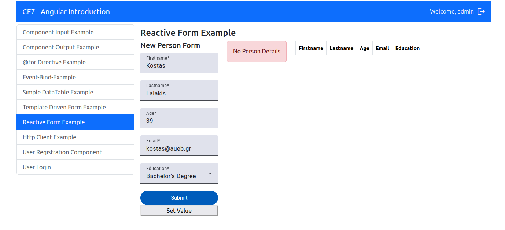

This app is connected with users-app repo which acts as its backend. It is just an example of Angular basics developed with angular 19 and node 10. 

First the user logs in:


If they log in as "admin" they are navigated directly to "user registration component". If not they are naviagated to a "no permission" page: 


The admin is the only one who can register a user. Most of the fields are required: 


Other checks are also taking place at frontend: 


As it is shown in the picture above, the admin is able to add or delete phone numbers and manage the type of it.

All users have permission though to all other components. 
The user can see jokes as bellow, show and send data via forms and tables which use different ways to show the data: 





Event bind example component is just a simple addition-subtraction-reset and input example:


Finally, there are input/output components and @for directive component which show the different ways of handling data. 


# AngularIntroduction

This project was generated using [Angular CLI](https://github.com/angular/angular-cli) version 19.2.13.

## Development server

To start a local development server, run:

```bash
ng serve
```

Once the server is running, open your browser and navigate to `http://localhost:4200/`. The application will automatically reload whenever you modify any of the source files.

## Code scaffolding

Angular CLI includes powerful code scaffolding tools. To generate a new component, run:

```bash
ng generate component component-name
```

For a complete list of available schematics (such as `components`, `directives`, or `pipes`), run:

```bash
ng generate --help
```

## Building

To build the project run:

```bash
ng build
```

This will compile your project and store the build artifacts in the `dist/` directory. By default, the production build optimizes your application for performance and speed.

## Running unit tests

To execute unit tests with the [Karma](https://karma-runner.github.io) test runner, use the following command:

```bash
ng test
```

## Running end-to-end tests

For end-to-end (e2e) testing, run:

```bash
ng e2e
```

Angular CLI does not come with an end-to-end testing framework by default. You can choose one that suits your needs.

## Additional Resources

For more information on using the Angular CLI, including detailed command references, visit the [Angular CLI Overview and Command Reference](https://angular.dev/tools/cli) page.
